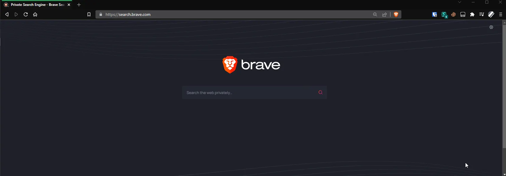

# Brave Search with Startpage, DuckDuckGo as an Image Service
Install with TamperMonkey by [viewing raw of 'startpageImagesBraveSearch.user.js'](https://github.com/anthony1x6000/BraveSearch-with-Startpage-Images/raw/main/startpageImagesBraveSearch.user.js) \
 Use images provided by other services in Brave Search \
 Better than using Bing or Google. \
To change services, modify "imageService" in the script to match the switch with your preferred service of ``startpage`` or ``duckduckgo``.

Hopefully Brave will release something better.
